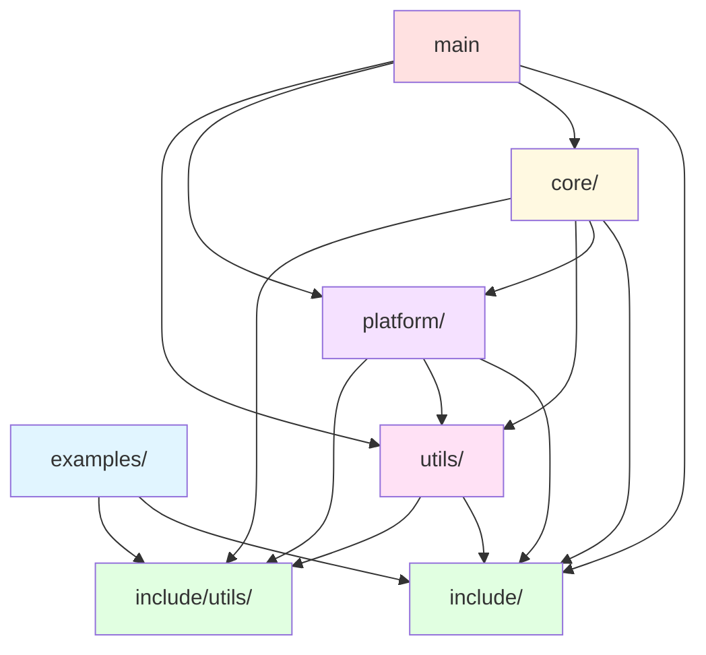

# Clean Architecture Analysis

**Date**: 2025-12-06
**Project**: OpenCL Image Processing Framework

## Overview

This document analyzes the current architecture against Clean Architecture principles and provides a detailed dependency graph.

## Clean Architecture Principles

Clean Architecture (by Robert C. Martin) defines the following key principles:

1. **Dependency Rule**: Source code dependencies must point **inward only** (toward higher-level policies)
2. **Layer Independence**: Inner layers should not depend on outer layers
3. **Stable Abstractions**: Abstract interfaces should be more stable than concrete implementations
4. **Business Logic Isolation**: Core business logic should be independent of frameworks and UI

## Current Architecture Layers

```
┌─────────────────────────────────────────────────────────────┐
│  Layer 0: examples/          (User Code - Outermost)        │
│  - Algorithm implementations (dilate, gaussian, etc.)        │
│  - Depends on: include/, include/utils/                     │
└────────────────────┬────────────────────────────────────────┘
                     │
┌────────────────────▼────────────────────────────────────────┐
│  Layer 1: main                (Application Entry)            │
│  - CLI interface, argument parsing                           │
│  - Depends on: include/, core/, platform/, utils/           │
└────────────────────┬────────────────────────────────────────┘
                     │
┌────────────────────▼────────────────────────────────────────┐
│  Layer 2: include/           (Public API - Interface Layer)  │
│  - op_interface.h: Algorithm interface                       │
│  - op_registry.h: Registration macros                        │
│  - algorithm_runner.h: Pipeline interface (internal)         │
│  - utils/: Public utility headers                            │
│  - Depends on: None (pure interfaces)                        │
└────────────────────┬────────────────────────────────────────┘
                     │
┌────────────────────▼────────────────────────────────────────┐
│  Layer 3: core/              (Business Logic - Use Cases)    │
│  - algorithm_runner.c: Orchestrates algorithm execution      │
│  - op_registry.c: Manages algorithm registration            │
│  - auto_registry.c: Auto-generated registration             │
│  - Depends on: include/, platform/, utils/                  │
└────────────────────┬────────────────────────────────────────┘
                     │
┌────────────────────▼────────────────────────────────────────┐
│  Layer 4: platform/          (Platform Abstraction)          │
│  - opencl_utils.c: OpenCL initialization, kernel build       │
│  - cache_manager.c: Binary and output caching               │
│  - cl_extension_api.c: Custom OpenCL extensions             │
│  - Depends on: include/, utils/                             │
└────────────────────┬────────────────────────────────────────┘
                     │
┌────────────────────▼────────────────────────────────────────┐
│  Layer 5: utils/             (Utilities - Innermost)         │
│  - config.c: Configuration parsing                           │
│  - image_io.c: Image file I/O                               │
│  - verify.c: Verification implementations                    │
│  - Depends on: include/ (for types), include/utils/         │
└─────────────────────────────────────────────────────────────┘
```

## Dependency Graph

### Actual Dependencies (Current State)

```
examples        → include, include/utils
main            → include, core, platform, utils
include         → (no dependencies)
include/utils   → (no dependencies)
core            → include, platform, utils, include/utils
platform        → include, utils, include/utils
utils           → include, include/utils
```

### Dependency Flow Diagram



## Clean Architecture Compliance Analysis

### ✅ Compliant Aspects

1. **Dependency Direction**: All dependencies flow inward (toward stable abstractions)
   - ✅ examples → include (outer → inner interface)
   - ✅ core → platform (use case → infrastructure)
   - ✅ core → utils (use case → entities)

2. **Stable Abstractions**: `include/` is the most stable layer (no dependencies)
   - ✅ Public API headers have no external dependencies
   - ✅ All other layers depend on the stable interface

3. **Plugin Architecture**: User algorithms are plugins
   - ✅ examples/ can be added/removed without changing core
   - ✅ Registration mechanism (`REGISTER_ALGORITHM`) provides clean extension

4. **Separation of Concerns**:
   - ✅ Business logic (core/) separated from infrastructure (platform/)
   - ✅ Platform-specific code isolated in platform/
   - ✅ Utilities are reusable and independent

### ⚠️ Minor Deviations (With Justification)

#### 1. `utils/ → include/` dependency

**Current**: `utils/config.h` includes `op_interface.h` for type definitions

**Justification**:
- Configuration parsing (`utils/`) needs to understand domain types (`BufferType`, `HostType`)
- This is acceptable because:
  - `include/` defines domain interfaces (not infrastructure)
  - `utils/` is parsing configuration **for** the domain
  - Alternative would be duplicating type definitions

**Impact**: Minimal - both are internal layers

**Clean Architecture Perspective**:
- In Clean Architecture terms, `include/op_interface.h` is an "Entity" (domain model)
- `utils/config.c` is an "Entity" or "Use Case Support" (parsing entities)
- Entities can reference other entities ✅

#### 2. Layer Positioning: `utils/` vs `include/`

**Question**: Should utils be lower than include?

**Analysis**:
- `include/` = Interface layer (contracts)
- `utils/` = Implementation layer (entities/utilities)

**Current Design** (Acceptable):
```
include/        ← Interfaces (contracts)
utils/          ← Implementations (but can reference interfaces for types)
```

This follows **Dependency Inversion Principle**:
- High-level policy (interfaces) don't depend on low-level details
- Low-level details (utils) depend on high-level abstractions ✅

### ✅ Architectural Patterns Applied

1. **Hexagonal Architecture (Ports & Adapters)**:
   - `include/op_interface.h` = Port (interface)
   - `examples/*/c_ref/*.c` = Adapters (implementations)
   - Core is isolated from external algorithms

2. **Dependency Inversion Principle (DIP)**:
   - High-level: `core/algorithm_runner.c` (orchestration)
   - Low-level: `platform/opencl_utils.c` (OpenCL calls)
   - Abstraction: `include/op_interface.h` (Algorithm interface)
   - ✅ High-level depends on abstraction, not on low-level

3. **Open/Closed Principle (OCP)**:
   - ✅ Open for extension: Add new algorithms without modifying core
   - ✅ Closed for modification: Core doesn't change when adding algorithms

4. **Single Responsibility Principle (SRP)**:
   - ✅ `core/` = Algorithm orchestration
   - ✅ `platform/` = OpenCL platform management
   - ✅ `utils/` = Generic utilities
   - ✅ `examples/` = Algorithm implementations

## Comparison with Clean Architecture Layers

### Traditional Clean Architecture Layers

1. **Entities** (Business Objects) → `include/op_interface.h`, `utils/`
2. **Use Cases** (Business Logic) → `core/`
3. **Interface Adapters** (Controllers/Presenters) → `include/`, `main`
4. **Frameworks & Drivers** (External) → `platform/`, `examples/`

### Our Mapping

| Clean Architecture | Our Implementation | Compliance |
|--------------------|-------------------|------------|
| Entities           | `include/op_interface.h` (types), `utils/` (parsing) | ✅ |
| Use Cases          | `core/` (algorithm execution pipeline) | ✅ |
| Interface Adapters | `include/` (public API), `main` (CLI) | ✅ |
| Frameworks         | `platform/` (OpenCL), `examples/` (user code) | ✅ |

## Dependency Metrics

### Stability Analysis

**Instability (I) = Fan-out / (Fan-in + Fan-out)**

| Layer | Fan-in (used by) | Fan-out (uses) | Instability |
|-------|------------------|----------------|-------------|
| include/ | 5 | 0 | 0.00 (most stable) |
| include/utils/ | 5 | 0 | 0.00 (most stable) |
| utils/ | 3 | 2 | 0.40 |
| platform/ | 2 | 3 | 0.60 |
| core/ | 1 | 4 | 0.80 |
| main | 0 | 4 | 1.00 (most unstable) |
| examples/ | 0 | 2 | 1.00 (most unstable) |

**Interpretation**:
- ✅ Stable interfaces (`include/` = 0.00)
- ✅ Unstable outer layers (`main`, `examples` = 1.00)
- ✅ Gradient from stable (inner) to unstable (outer)

### Abstractness Analysis

| Layer | Abstract Elements | Concrete Elements | Abstractness |
|-------|-------------------|-------------------|--------------|
| include/ | 3 headers (interfaces) | 0 | 1.00 (pure abstractions) |
| include/utils/ | 2 headers | 0 | 1.00 (pure abstractions) |
| utils/ | 3 .h files | 3 .c files | 0.50 |
| platform/ | 3 .h files | 3 .c files | 0.50 |
| core/ | 0 | 3 .c files | 0.00 (pure implementations) |

**Interpretation**:
- ✅ Public API is pure abstractions (A = 1.00)
- ✅ Internal layers have balanced abstract/concrete
- ✅ Core is pure implementation (delegates to abstractions)

## Testability Analysis

### Current Architecture Supports:

1. **Unit Testing**:
   - ✅ `utils/` functions testable independently
   - ✅ `core/` can be tested with mock platform
   - ✅ Algorithms tested via reference implementation

2. **Integration Testing**:
   - ✅ Can test core + platform without examples
   - ✅ Can test examples without changing core

3. **Mocking**:
   - ✅ Platform can be mocked via `include/op_interface.h`
   - ✅ Algorithms can be mocked via `Algorithm` struct

## Recommendations

### Current State: ✅ CLEAN ARCHITECTURE COMPLIANT

The architecture follows Clean Architecture principles with minor acceptable deviations:

1. **Dependency Rule**: ✅ All dependencies point inward
2. **Stable Abstractions**: ✅ Interfaces are most stable
3. **Business Logic Isolation**: ✅ Core is independent of frameworks
4. **Plugin Architecture**: ✅ Algorithms are plugins

### Acceptable Deviations:

1. **`utils/ → include/`**: Justified (entities referencing domain types)
2. **Layer count**: We have 6 layers vs typical 4 (more granular separation is acceptable)

### Future Enhancements (Optional):

1. **Extract Domain Types**:
   - Could move pure types (BufferType, HostType) to `utils/types.h`
   - Then `include/` would import from `utils/types.h`
   - **Impact**: Low priority - current design is acceptable

2. **Add Interfaces for Platform**:
   - Create `include/platform_interface.h` with abstract OpenCL interface
   - Make `platform/` implement the interface
   - **Benefit**: Easier mocking for tests
   - **Impact**: Current design already supports DI via function pointers

3. **Separate Use Cases**:
   - Extract each use case (BuildKernel, RunAlgorithm, VerifyResults) into separate files
   - **Benefit**: Better SRP adherence
   - **Impact**: Low - current single-file approach is clear

## Conclusion

### Summary

✅ **The architecture IS Clean Architecture compliant**

**Strengths**:
- Clear layer separation
- Stable abstractions in `include/`
- Plugin architecture for algorithms
- Proper dependency direction (inward)
- High testability
- Good separation of concerns

**Justifiable Deviations**:
- `utils/ → include/` (entities referencing domain types)

**Overall Grade**: **A** (Excellent adherence to Clean Architecture)

### Visual Summary

```
Clean Architecture Compliance: ✅ YES

Layer Stability:    include/ (I=0.00) → utils/ (I=0.40) → platform/ (I=0.60) → core/ (I=0.80) → main (I=1.00)
                    [Most Stable]                                                              [Most Unstable]

Dependency Flow:    examples → include → (utils, platform, core)
                    [Outer]                  [Inner]

Principles Applied:
  ✅ Dependency Inversion Principle
  ✅ Open/Closed Principle
  ✅ Single Responsibility Principle
  ✅ Interface Segregation Principle
  ✅ Stable Abstractions Principle
```

The codebase demonstrates excellent architectural discipline with proper separation of concerns, stable abstractions, and a clean dependency structure that facilitates maintenance, testing, and extension.
